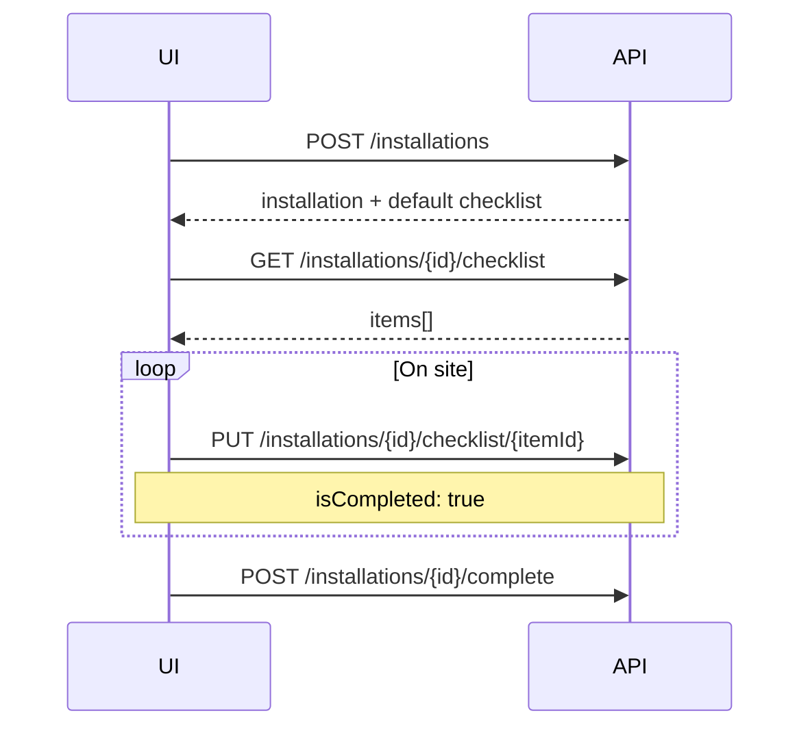

# Installation Checklist — Backend API Documentation

> **Base URL:** `/api/v1/installations/{installationId}/checklist`  
> **Auth:** Bearer JWT (`TenantJwt` scheme, `society_id` claim required)  
> **Last updated:** 2026-05-18

---

## Overview

Each **installation** (`app.Installations`) owns a checklist of tasks the technician must complete on site. Items are stored in **`app.InstallationChecklist`** (`InstallationChecklistItem`).

**Behaviour:**
- Creating an installation (`POST /installations`) automatically seeds **6 default items** (French labels) unless `defaultChecklistItems` is provided.
- Checklist items are **tenant-scoped** (`SocietyId`) and **soft-deleted** when removed.
- Progress is exposed on installation list/detail as `checklistCompleted` / `checklistTotal`.

**Default checklist (on create or initialize):**

1. Préparation chantier  
2. Pose structure / rails  
3. Pose panneaux  
4. Câblage DC / AC  
5. Mise en service  
6. Contrôle qualité / photos  

---

## Domain Entity

### `InstallationChecklistItem` (table: `app.InstallationChecklist`)

| Column | Type | Description |
|--------|------|-------------|
| `Id` | `uuid` | PK |
| `SocietyId` | `uuid` | Tenant scope |
| `InstallationId` | `uuid` | Parent installation (FK) |
| `Item` | `text` | Task label |
| `IsCompleted` | `bool` | Checked on site |
| `CreatedAt`, `UpdatedAt`, `IsDeleted` | | Audit / soft delete |

---

## Endpoints

### `GET /api/v1/installations/{installationId}/checklist`

Returns all active checklist items for the installation, ordered by creation time.

**Response 200:**
```json
{
  "success": true,
  "data": [
    {
      "id": "uuid",
      "item": "Pose panneaux",
      "isCompleted": false
    },
    {
      "id": "uuid",
      "item": "Câblage DC / AC",
      "isCompleted": true
    }
  ]
}
```

The same array is included on `GET /api/v1/installations/{id}` under `checklist`.

---

### `POST /api/v1/installations/{installationId}/checklist`

Adds **one** checklist item.

**Request body:**
```json
{
  "item": "Vérification toiture"
}
```

**Response 201:**
```json
{
  "success": true,
  "data": {
    "id": "uuid",
    "item": "Vérification toiture",
    "isCompleted": false
  }
}
```

---

### `POST /api/v1/installations/{installationId}/checklist/initialize`

Seeds the default checklist **only when the installation has zero items**. If items already exist, returns the current list unchanged (idempotent).

**Request body (optional):**
```json
{
  "items": [
    "Étape personnalisée 1",
    "Étape personnalisée 2"
  ]
}
```

Omit `items` or send an empty array to use the 6 society defaults.

**Response 200:** Full checklist array (same shape as `GET`).

**Use case:** Installation created without checklist, or checklist cleared — call initialize before field work.

---

### `PUT /api/v1/installations/{installationId}/checklist`

**Bulk update** — typically used from mobile to tick multiple boxes at once.

**Request body:**
```json
{
  "items": [
    { "id": "uuid-1", "isCompleted": true },
    { "id": "uuid-2", "isCompleted": true, "item": "Pose panneaux (terminée)" }
  ]
}
```

| Field | Required | Description |
|-------|----------|-------------|
| `items[].id` | yes | Checklist item id |
| `items[].isCompleted` | yes | New completion state |
| `items[].item` | no | Optional label rename |

Unknown ids are skipped silently.

**Response 200:** Full updated checklist array.

---

### `PUT /api/v1/installations/{installationId}/checklist/{itemId}`

Updates **one** item (partial body).

**Request body:**
```json
{
  "item": "Contrôle qualité",
  "isCompleted": true
}
```

All fields are optional; send only what changes.

**Response 200:**
```json
{
  "success": true,
  "data": {
    "id": "uuid",
    "item": "Contrôle qualité",
    "isCompleted": true
  }
}
```

---

### `DELETE /api/v1/installations/{installationId}/checklist/{itemId}`

Soft-deletes a checklist item (`IsDeleted = true`).

**Response 200:**
```json
{
  "success": true,
  "data": { "deleted": true }
}
```

---

## Related installation endpoints

| Method | Route | Role |
|--------|-------|------|
| GET | `/api/v1/installations` | List with `checklistCompleted` / `checklistTotal` |
| GET | `/api/v1/installations/{id}` | Detail including full `checklist` |
| POST | `/api/v1/installations` | Create + optional `defaultChecklistItems` |
| POST | `/api/v1/installations/{id}/start` | Start on-site work |
| POST | `/api/v1/installations/{id}/complete` | Mark installation done |
| POST | `/api/v1/installations/{id}/photos` | Upload photo URL |

### Create installation with custom checklist

```json
POST /api/v1/installations
{
  "projectId": "uuid",
  "technicianId": "uuid",
  "date": "2026-06-20",
  "defaultChecklistItems": [
    "Brief sécurité",
    "Pose",
    "Raccordement",
    "Test"
  ]
}
```

---

## Typical frontend flow



**Alternative (bulk tick):** `PUT /installations/{id}/checklist` with all changed items in one request.

---

## Error codes

| Code | HTTP | Description |
|------|------|-------------|
| `INSTALLATION_NOT_FOUND` | 404 | Installation id invalid for this society |
| `CHECKLIST_ITEM_NOT_FOUND` | 404 | Item id invalid for this installation |
| `VALIDATION_ERROR` | 400 | Empty `item` label |
| `PROJECT_NOT_FOUND` | 404 | (on create only) |
| `USER_NOT_IN_SOCIETY` | 400 | Invalid `technicianId` |
| `UNAUTHORIZED` | 401 | Missing JWT |
| `TENANT_REQUIRED` | 403 | No `society_id` claim |

---

## Database

No new migration required — table `app.InstallationChecklist` exists since initial app schema.

**Index:** `IX_InstallationChecklist_SocietyId` on `SocietyId`  
**FK:** `InstallationId` → `app.Installations.Id`

---

## Service

All checklist operations are implemented in `InstallationWorkflowService` (`IInstallationWorkflowService`).

```csharp
// Registered in DependencyInjection.cs
services.AddScoped<IInstallationWorkflowService, InstallationWorkflowService>();
```

---

## Integration notes

| Scenario | API |
|----------|-----|
| Show progress bar | `checklistCompleted / checklistTotal` from list or detail |
| Add ad-hoc step on site | `POST .../checklist` |
| Remove wrong step | `DELETE .../checklist/{itemId}` |
| Reset empty installation | `POST .../checklist/initialize` |
| Technician workspace | `GET /api/v1/me/installations` includes checklist counts |
